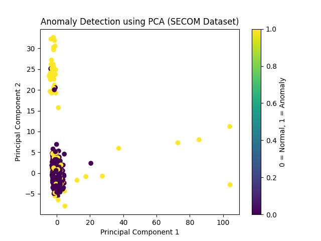

# 🔍 Anomaly Detection using SECOM Dataset

## 📌 Project Overview
This project detects anomalies (machine failures) in semiconductor manufacturing data using Machine Learning.

---

## 🚀 Features
- Data preprocessing & cleaning
- Handling missing values
- Isolation Forest model
- PCA visualization
- Flask API deployment
- Postman testing

---

## 🛠️ Technologies Used
- Python
- Pandas
- NumPy
- Scikit-learn
- Flask
- Matplotlib

---

## 📊 PCA Visualization



---

## ▶️ How to Run

### 1. Train Model
```bash
python train.py
